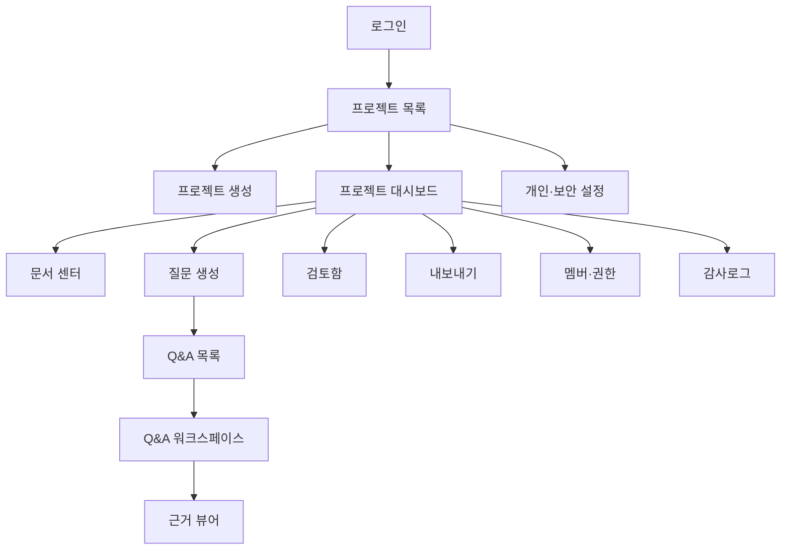
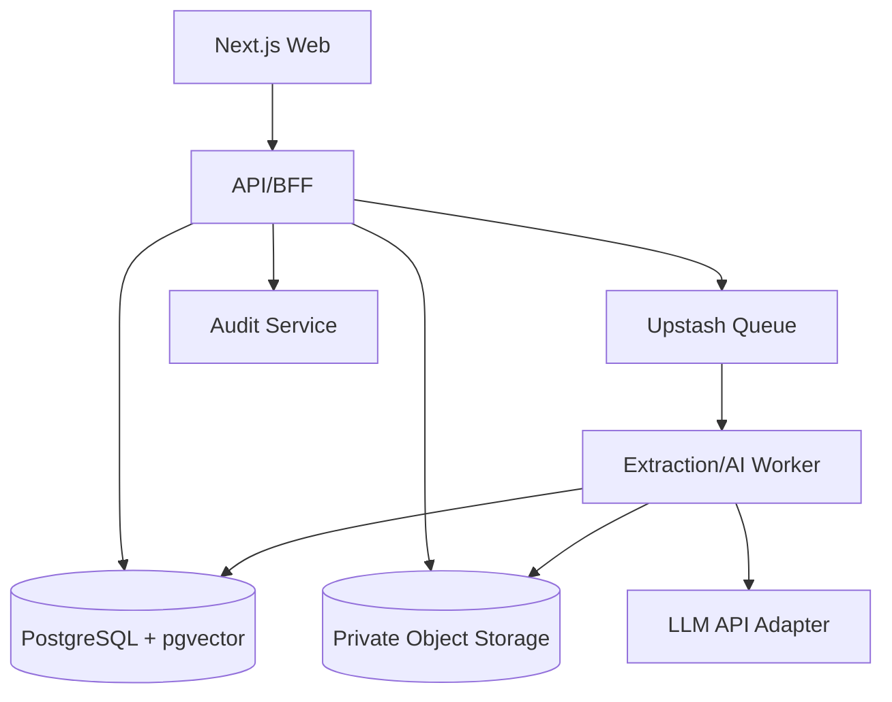
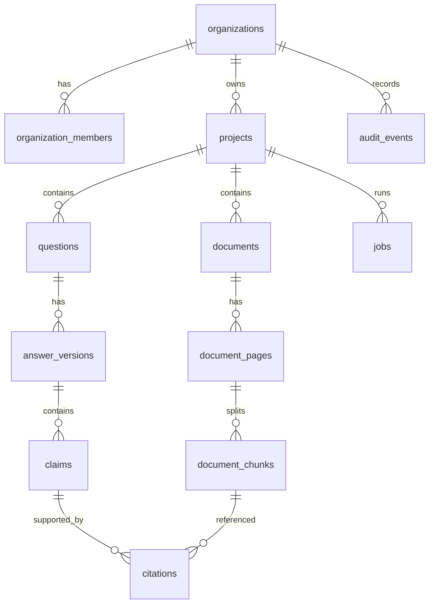
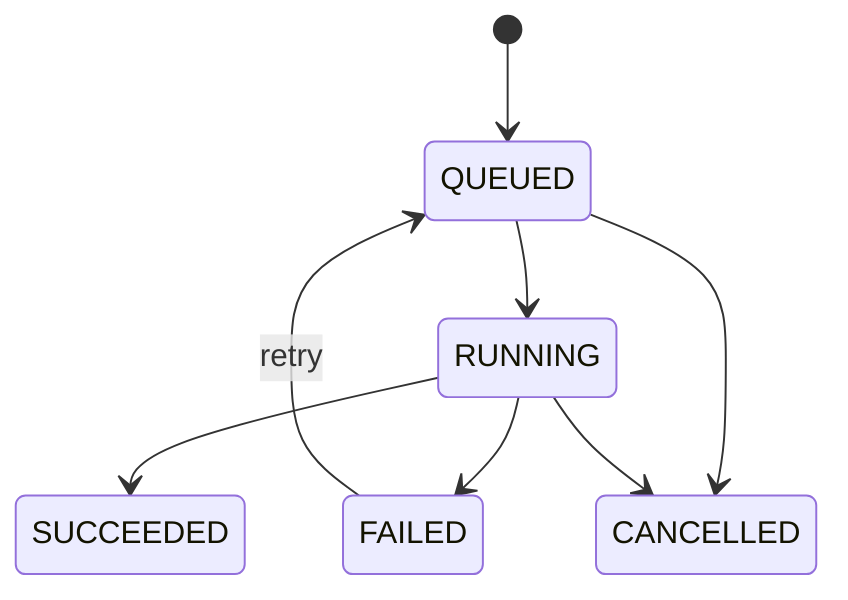

# IPO Proof 웹앱 통합 개발 명세서

> **Cursor / Codex / Claude Code 실행 지시:** 이 문서를 제품 요구사항과 구현 계약의 단일 기준(Source of Truth)으로 사용한다. 임의로 기능을 추가하지 말고 MVP 범위를 우선 구현한다. 각 구현 단위는 테스트 우선(TDD)으로 진행하며, 체크박스를 갱신한다. 불명확한 세부사항은 본 문서의 기본값을 적용한다. 보안 또는 데이터 손실 위험이 있는 경우에만 작업을 중단하고 사용자에게 확인한다.

**문서 버전:** 1.0.0  
**기준일:** 2026-09-11 (Asia/Seoul)  
**제품명:** IPO Proof (아이피오 프루프)  
**제품 범주:** 근거 기반 IPO 상장심사 Q&A 및 증빙 매핑 코파일럿  
**목표 시장:** 대한민국 IPO 준비 비상장회사  
**최초 사용자:** CFO, 재무팀장, IPO 실무자  
**문서 상태:** MVP 구현 승인용 기준안

---

## 0. 제품 한 문장

IPO Proof는 기업 내부 문서를 분석하여 상장심사 예상 질문과 답변 초안을 만들고, 답변의 각 주장에 원문 문서·페이지 근거를 연결하는 보안 중심 웹앱이다.

### 브랜드 약속

> **모든 답변에 근거를.**

### 브랜드 원칙

- 생성보다 검증을 우선한다.
- 근거 없는 사실 문장을 완성된 답변처럼 보여주지 않는다.
- AI 결과는 초안이며 전문가 검토가 필요함을 명확히 표시한다.
- “심사 통과 보장”, “완전 자동”, “오류 없음”을 마케팅 문구로 사용하지 않는다.

---

# Part A. PRD

## 1. 문제 정의

IPO 준비기업은 상장예비심사 과정에서 여러 부서와 외부 자문기관이 보유한 대량의 문서를 검토하고, 예상 질문에 대한 일관된 답변과 증빙을 준비해야 한다. 현재 업무는 다음 문제를 가진다.

1. 동일 사실을 여러 문서에서 반복 탐색해야 한다.
2. 질문별 답변 작성에 많은 시간이 소요된다.
3. 답변의 수치·날짜·고유명사가 원문과 불일치할 수 있다.
4. 근거 문서와 페이지가 분리되어 검토 및 인수인계가 어렵다.
5. 민감한 재무·주주·계약 정보 때문에 범용 AI 사용이 부담스럽다.

## 2. 목표와 비목표

### 2.1 MVP 목표

- PDF, DOCX, XLSX 파일을 프로젝트 단위로 안전하게 업로드한다.
- 파일을 텍스트와 표로 추출하고 페이지 단위 청크로 색인한다.
- 6개 카테고리에서 예상 심사 질문 20개를 생성한다.
- 질문마다 근거 기반 답변 초안을 생성한다.
- 답변의 주장별로 문서명, 페이지, 원문 인용을 제공한다.
- 근거가 없거나 충돌하는 주장을 명시적으로 표시한다.
- 사용자가 답변을 편집·승인하고 DOCX/XLSX로 내보낸다.
- 테넌트 격리, 역할 기반 접근제어, 감사로그, 삭제 기능을 제공한다.

### 2.2 비목표

- 상장 승인 가능성 예측 또는 통과 보장
- 변호사·회계사·주관사의 전문 판단 대체
- 상장예비심사청구서 전체 자동 제출
- KRX 또는 DART에 대한 자동 제출
- 실시간 공동편집, 결제, 모바일 네이티브 앱
- 해외 거래소 규정 지원
- 이미지 기반 스캔 문서의 완전한 표 복원 보장

## 3. 사용자 및 권한

| 역할 | 설명 | 주요 권한 |
|---|---|---|
| OWNER | 회사 프로젝트 소유자 | 조직·멤버·보안·삭제 포함 전체 권한 |
| ADMIN | IPO 프로젝트 관리자 | 프로젝트, 문서, Q&A, 내보내기, 멤버 관리 |
| EDITOR | 재무/IPO 실무자 | 문서 업로드, Q&A 생성·편집, 내보내기 |
| REVIEWER | CFO·외부 검토자 | 조회, 댓글, 승인·반려 |
| VIEWER | 제한 열람자 | 조회만 가능, 원문 다운로드는 별도 권한 |

권한은 조직(tenant)과 프로젝트 두 단계에서 검사한다. 모든 DB 조회는 `organization_id`와 `project_id` 범위를 포함해야 한다.

## 4. 핵심 사용자 스토리

### US-01 프로젝트 시작

사용자는 회사명, 시장, 업종, 목표 청구일을 입력하여 IPO 프로젝트를 만든다.

**수용기준**

- 필수값 누락 시 인라인 오류가 표시된다.
- 생성자는 OWNER이며 조직과 프로젝트가 생성된다.
- 목표 청구일은 Asia/Seoul 날짜로 저장·표시한다.

### US-02 문서 업로드 및 분석

사용자는 기업 문서를 업로드하고 처리 상태와 오류를 확인한다.

**수용기준**

- 허용 확장자: `.pdf`, `.docx`, `.xlsx`; 파일당 최대 50MB; 프로젝트당 MVP 최대 100개.
- 악성 파일 검사 전에는 본문 추출을 시작하지 않는다.
- SHA-256이 동일한 파일은 중복 경고한다.
- 상태는 `UPLOADED → SCANNING → EXTRACTING → INDEXING → READY` 또는 `FAILED`로 전이한다.
- 실패 사유와 재시도 버튼을 제공한다.

### US-03 예상 질문 생성

사용자는 카테고리, 질문 수, 심층도를 선택해 예상 질문을 생성한다.

**수용기준**

- 기본값은 6개 카테고리, 총 20개, 심층도 `STANDARD`이다.
- 중복 질문은 의미 유사도 0.88 이상일 때 병합 후보로 표시한다.
- 질문마다 카테고리, 중요도, 생성 근거, 예상 꼬리질문을 저장한다.

### US-04 근거 기반 답변 생성

사용자는 질문별 답변 초안과 근거를 확인한다.

**수용기준**

- 모든 사실 주장에는 하나 이상의 citation이 있어야 한다.
- 근거가 없는 사실은 작성하지 않고 `[추가 자료 필요]`로 반환한다.
- 서로 다른 문서의 수치·날짜가 충돌하면 `[근거 충돌]`로 표시하고 양쪽 근거를 제시한다.
- 인용 클릭 시 원문 뷰어가 해당 페이지와 영역으로 이동한다.

### US-05 편집·검토·승인

EDITOR가 답변을 수정하고 REVIEWER가 승인 또는 반려한다.

**수용기준**

- AI 초안과 사용자 수정본을 별도 버전으로 보존한다.
- 승인 이후 편집하면 상태가 `NEEDS_REVIEW`로 돌아간다.
- 모든 상태 변경은 감사로그에 남는다.

### US-06 내보내기

사용자는 선택한 Q&A를 DOCX 또는 XLSX로 내보낸다.

**수용기준**

- 문서에 질문, 답변, 상태, 근거 문서, 페이지, 원문 인용, 생성 시각을 포함한다.
- 내보내기 파일에 “AI 생성 초안·전문가 검토 필요” 문구를 표시한다.
- 권한이 없는 사용자의 내보내기 요청은 403으로 거부한다.

## 5. 질문 카테고리

| 코드 | 카테고리 | 대표 쟁점 |
|---|---|---|
| BUSINESS | 사업모델·성장성 | 수익모델, 경쟁우위, 시장 규모, 지속가능성 |
| FINANCE | 재무·수익성 | 매출 추이, 손익, 현금흐름, 회계 추정 |
| CUSTOMER | 고객·거래처 | 매출 집중, 계약 안정성, 특수관계자 거래 |
| GOVERNANCE | 지배구조 | 주주, 의사결정, 이해상충, 관계회사 |
| INTERNAL_CONTROL | 내부통제 | 회계관리, 승인체계, 권한분리, 개선조치 |
| RISK | 주요 위험 | 규제, 소송, 기술, 인력, 공급망, IP |

## 6. 성공지표

| 구분 | 지표 | MVP 목표 |
|---|---|---:|
| 활성화 | 가입 후 첫 READY 문서 도달률 | ≥ 70% |
| 가치 도달 | 첫 Q&A 생성까지 중앙시간 | ≤ 15분(문서 10개 기준) |
| 근거성 | 사실 주장 중 citation 연결률 | 100% |
| 품질 | 사용자 승인 전 평균 수정률 | 측정 시작, 기준선 확보 |
| 신뢰 | 근거 클릭 후 원문 도달 성공률 | ≥ 99% |
| 안정성 | 월간 API 성공률 | ≥ 99.5% |
| 성능 | 일반 API p95 | < 800ms |
| 성능 | AI 작업 생성 응답 | < 2초, 이후 비동기 |

## 7. 우선순위

### P0

인증, 조직/프로젝트, 문서 업로드·처리, 질문 생성, 답변 생성, citation, 편집/승인, 내보내기, 감사로그, 삭제.

### P1

댓글, 질문 병합, 답변 비교, 프로젝트 대시보드 품질 지표, 문서 재처리, 이메일 알림.

### P2

주관사 템플릿, 다중 프로젝트 포트폴리오, SSO/SAML, 고객 관리형 키, 한국 리전 전용 배포, 실시간 공동편집.

---

# Part B. UX·브랜드·전체 화면 와이어프레임

## 8. 디자인 시스템

### 8.1 톤

- 금융 B2B의 신뢰감, 높은 정보 밀도, 차분한 시각 계층.
- 장식적 그래디언트와 과도한 AI 이미지를 피한다.
- 위험·충돌·미확인 상태는 색상과 아이콘, 텍스트를 함께 사용한다.

### 8.2 토큰

| 토큰 | 값 | 용도 |
|---|---|---|
| Brand Navy | `#14213D` | 헤더, 주요 텍스트 |
| Proof Blue | `#2563EB` | CTA, 링크, 선택 상태 |
| Evidence Green | `#15803D` | 근거 확인됨 |
| Warning Amber | `#B45309` | 추가 자료 필요 |
| Conflict Red | `#B91C1C` | 근거 충돌·오류 |
| Surface | `#F8FAFC` | 배경 |
| Border | `#D7DEE8` | 경계선 |
| Text | `#111827` | 본문 |

폰트는 `Pretendard Variable`, fallback `Inter, system-ui, sans-serif`; 본문 14–16px, 표 13–14px, 최소 터치 영역 44×44px. WCAG 2.2 AA 대비를 충족한다.

## 9. 정보 구조



## 10. 공통 레이아웃

- 데스크톱 우선, 최소 지원 폭 1024px; 1440px 기준 설계.
- 왼쪽 240px 프로젝트 내비게이션, 상단 64px 조직/프로젝트 전환 및 사용자 메뉴.
- 콘텐츠 최대 폭 1440px. 문서+답변 작업 화면은 3패널 가변 레이아웃.
- 모바일은 MVP에서 조회와 승인만 지원하며 업로드·대량편집은 “데스크톱 권장” 안내.

## 11. 전체 화면 14개 와이어프레임

### S01. 로그인

| 영역 | 구성 |
|---|---|
| 상단 | IPO Proof 로고, “모든 답변에 근거를” |
| 중앙 카드 | 이메일, 비밀번호, 로그인, 비밀번호 찾기 |
| 보안 안내 | 고객 자료 비학습, 암호화, 접근기록 안내 |
| 하단 | 이용약관, 개인정보처리방침, 문의 |

**상태:** 기본, 입력 오류, 계정 잠김, MFA 요구, 세션 만료.  
**주요 행동:** 로그인 성공 시 마지막 프로젝트 또는 S03으로 이동.

### S02. 회원가입·조직 생성

| 단계 | 필드/행동 |
|---|---|
| 1 계정 | 이름, 업무 이메일, 비밀번호, 약관 동의 |
| 2 조직 | 회사명, 사업자등록번호(선택), 조직명 |
| 3 보안 | MFA 설정 권장, 복구코드 다운로드 |

**수용기준:** 이메일 인증 전 민감 문서 업로드 불가; OWNER 자동 부여.

### S03. 프로젝트 목록

| 영역 | 구성 |
|---|---|
| 헤더 | “IPO 프로젝트”, 새 프로젝트 버튼 |
| 요약 카드 | 진행 중, 검토 대기, 근거 부족, 최근 활동 |
| 프로젝트 표 | 회사명, 시장, 목표일, READY 문서, Q&A 진행률, 최근 수정 |
| 빈 상태 | 제품 설명, 데모가 아닌 실제 프로젝트 만들기 CTA |

필터: 상태, 시장(KOSPI/KOSDAQ/KONEX/미정), 담당자. 검색: 회사명.

### S04. 프로젝트 생성 마법사

| 단계 | 입력 |
|---|---|
| 1 기본정보 | 회사명, 영문명, 업종, 홈페이지 |
| 2 상장계획 | 목표시장, 목표 청구일, 주관사(선택) |
| 3 분석범위 | 6개 질문 카테고리, 기본 질문 수 20 |
| 4 확인 | 개인정보·영업비밀 처리 안내, 생성 |

오른쪽에는 입력 내용 요약과 예상 처리 흐름을 고정 표시한다.

### S05. 프로젝트 대시보드

| 영역 | 구성 |
|---|---|
| 상단 | 회사명, 시장, 목표일, 설정 |
| KPI | 문서 준비도, Q&A 완료율, 근거 확인률, 충돌 건수 |
| 다음 행동 | 실패 문서 재처리, 근거 부족 답변 보완, 검토 대기 승인 |
| 최근 활동 | 업로드·생성·편집·승인 타임라인 |
| 빠른 실행 | 문서 업로드, 질문 생성, 내보내기 |

KPI는 점수만 보여주지 않고 분자/분모를 함께 표시한다.

### S06. 문서 센터

| 영역 | 구성 |
|---|---|
| 도구막대 | 업로드, 검색, 유형/상태 필터, 정렬 |
| 드롭존 | PDF/DOCX/XLSX, 50MB 제한, 암호화 파일 안내 |
| 문서 표 | 파일명, 유형, 버전, 페이지, 상태, 업로더, 업로드 시각 |
| 행 액션 | 미리보기, 재처리, 다운로드, 삭제 |

상태 배지: 업로드됨, 검사 중, 추출 중, 색인 중, 준비됨, 실패. 삭제는 영향받는 citation 수를 먼저 보여주고 확인문구 입력을 요구한다.

### S07. 문서 상세·추출 검증

| 패널 | 구성 |
|---|---|
| 왼쪽 | 페이지 썸네일, 페이지 검색 |
| 중앙 | 원문 PDF/문서 렌더링 |
| 오른쪽 | 추출 텍스트, 표 목록, 메타데이터, 처리 로그 |

**행동:** 페이지별 추출 결과 확인, 잘못 추출된 페이지 제외, 재처리. 원문과 추출문 동기 스크롤.

### S08. 질문 생성 설정

| 영역 | 구성 |
|---|---|
| 자료 범위 | READY 문서 전체 또는 선택 문서 |
| 카테고리 | 6개 카테고리 체크박스 |
| 질문 수 | 10/20/30, 기본 20 |
| 심층도 | 빠른 검토/표준/심층, 기본 표준 |
| 미리보기 | 예상 비용 범위, 예상 시간, 생성 기준 |

생성 버튼 클릭 시 작업 ID를 반환하고 S09로 이동한다. 동일 입력 재실행 시 사용자 확인을 받는다.

### S09. 생성 진행

| 영역 | 구성 |
|---|---|
| 진행 단계 | 자료 검색 → 쟁점 추출 → 질문 생성 → 중복 정리 → 저장 |
| 카테고리별 현황 | 완료/진행/대기/실패 |
| 로그 | 사용자 친화적인 단계 메시지와 시작 시각 |
| 행동 | 백그라운드 실행, 취소, 실패 시 재시도 |

브라우저를 닫아도 서버 작업은 계속된다. 완료 시 앱 내 알림을 표시한다.

### S10. Q&A 목록

| 영역 | 구성 |
|---|---|
| 상단 KPI | 전체, 미작성, 근거 부족, 충돌, 검토 대기, 승인 |
| 도구막대 | 검색, 카테고리/중요도/상태/담당자 필터 |
| 표 | 번호, 질문, 카테고리, 중요도, 근거상태, 담당자, 검토상태 |
| 대량행동 | 담당자 지정, 답변 생성, 검토 요청, 내보내기 |

기본 정렬은 `근거 충돌 → 근거 부족 → 높은 중요도 → 최근 생성`이다.

### S11. Q&A 워크스페이스

| 패널 | 구성 |
|---|---|
| 왼쪽 280px | 질문 목록, 필터, 이전/다음 |
| 중앙 가변 | 질문, 중요도, 답변 편집기, 주장별 citation 칩, 꼬리질문 |
| 오른쪽 400px | 근거 카드, 원문 미리보기, 충돌·부족 경고 |
| 하단 고정 | 저장, AI 재작성, 검토 요청, 승인/반려 |

AI 재작성 옵션은 더 간결하게, CFO 관점, 근거만 사용, 선택 문단만 재작성으로 제한한다. 자동저장 간격 5초, 저장 실패 시 로컬 임시본과 경고를 유지한다.

### S12. 근거 전체화면 뷰어

| 영역 | 구성 |
|---|---|
| 상단 | 파일명, 버전, 페이지, 다운로드 권한 상태 |
| 중앙 | 원문 렌더링과 하이라이트 영역 |
| 오른쪽 | 연결된 주장, 인용문, 유사도, 근거 적합성 피드백 |
| 하단 | 이전/다음 citation |

사용자는 “정확함/부정확함/불충분함” 피드백을 남길 수 있다. 이 피드백은 모델 학습에 자동 사용하지 않고 평가 데이터셋 후보로 별도 보관한다.

### S13. 검토함

| 영역 | 구성 |
|---|---|
| 요약 | 내 검토 대기, 반려됨, 승인됨 |
| 목록 | 질문, 답변 변경요약, 근거상태, 요청자, 요청시각 |
| 비교 뷰 | 이전 버전과 현재 버전 diff |
| 행동 | 승인, 사유를 포함한 반려, 댓글 |

근거 충돌 상태에서는 승인 버튼 클릭 시 추가 확인을 요구하고 감사로그에 예외 승인을 기록한다.

### S14. 내보내기·설정 통합

탭 1 **내보내기**: 범위, 형식(DOCX/XLSX), 포함 항목, 정렬, 워터마크, 생성 이력.  
탭 2 **멤버·권한**: 초대, 역할 변경, 원문 다운로드 권한, 비활성화.  
탭 3 **감사로그**: 사용자, 행동, 대상, 시각, IP 마스킹값, CSV 내보내기.  
탭 4 **데이터 관리**: 보존기간, 프로젝트 내보내기, 프로젝트 삭제, 조직 탈퇴.

삭제는 프로젝트명 재입력과 MFA를 요구하며 7일 복구대기 후 영구 삭제한다. 법적 보존 의무가 설정된 경우 삭제를 차단하고 관리자에게 사유를 표시한다.

## 12. 반응형·접근성

- 키보드만으로 모든 핵심 행동 수행 가능.
- 포커스 링을 제거하지 않는다.
- 상태를 색상만으로 표현하지 않는다.
- 표에는 caption과 열 헤더를 제공한다.
- 모달 열림 시 포커스 트랩, 닫힘 시 트리거 복귀.
- AI 진행 상태는 `aria-live="polite"`로 알린다.
- 200% 확대에서도 가로 스크롤을 Q&A 작업 영역 내부로 제한한다.

---

# Part C. 시스템 아키텍처

## 13. 권장 기술 스택

| 영역 | 선택 | 고정 원칙 |
|---|---|---|
| Web | Next.js 16.3 App Router, React, TypeScript | 정확한 패치 버전은 `pnpm-lock.yaml`에 고정 |
| UI | Tailwind CSS, shadcn/ui, Radix primitives | WCAG 2.2 AA |
| API | Next.js Route Handlers, OpenAPI 3.1 | `/api/v1` 버저닝 |
| DB | PostgreSQL 17+와 pgvector | RLS 필수, UTC 저장 |
| Auth | Supabase Auth 또는 동등 OIDC | 이메일 인증, MFA, 세션 회수 |
| Object Storage | S3 호환 private bucket | presigned URL, SSE-KMS |
| Queue/Rate limit | Upstash QStash/Redis | 비동기 작업, idempotency, sliding window |
| AI | OpenAI Responses API 호환 어댑터 | 모델명 환경변수, JSON Schema 출력, 1,536차원 embedding |
| Extraction | `pymupdf`, `python-docx`, `openpyxl` 기반 Python worker | 샌드박스, 네트워크 차단 |
| Observability | OpenTelemetry, Sentry 호환 오류수집 | 원문·프롬프트 본문 로그 금지 |
| Testing | Vitest, Testing Library, Playwright, pytest | 단위·통합·E2E·보안 |
| Deployment | Vercel/컨테이너 + 관리형 Postgres + private storage | 서울 리전 우선 검토 |

Next.js 16.3은 2026-08-03 공개 기준이다. 생성 시 모든 패키지는 정확한 버전으로 설치하고 caret(`^`) 없는 lockfile을 커밋한다. 프로덕션 모델은 별칭이 아니라 배포 시점에 검증된 snapshot ID를 환경변수에 기록한다. 임베딩 모델은 출력 차원을 1,536으로 고정하며 모델 교체로 차원이 달라질 때에는 별도 컬럼·재색인 migration을 수행한다.

## 14. 논리 아키텍처



### 경계 원칙

- Web은 원본 storage key와 서비스 비밀값을 알 수 없다.
- API만 권한 검증 후 제한시간 presigned URL을 발급한다.
- Worker는 작업에 필요한 프로젝트 범위 토큰만 사용한다.
- AI 공급자에게 organization_id, 사용자 이메일 등 직접 식별자를 보내지 않는다.
- 원문 전송은 선택된 retrieval chunk로 제한한다.

## 15. 데이터 흐름

### 업로드

1. 클라이언트가 업로드 세션 생성 요청.
2. API가 MIME, 확장자, 크기, 권한을 검사하고 presigned PUT URL 발급.
3. 클라이언트가 private storage로 업로드.
4. 클라이언트가 완료 API에 SHA-256과 크기를 제출.
5. Worker가 악성파일 검사, 텍스트 추출, 청크 생성, 임베딩, 색인을 수행.
6. 문서 상태를 READY로 변경하고 감사로그 기록.

### 답변 생성

1. 질문을 카테고리·엔터티·시간범위로 분석.
2. hybrid retrieval: 키워드 검색 + 벡터 검색 + 메타데이터 필터.
3. top 30 후보를 rerank하여 최대 12개 청크 선택.
4. 질문 생성 또는 답변 생성 프롬프트 호출.
5. JSON Schema 검증, citation 존재·범위·문서 소속 검증.
6. citation이 없는 사실 주장을 차단하거나 `NEEDS_EVIDENCE` 처리.
7. 결과와 모델 snapshot, prompt version, retrieval set hash를 저장.

---

# Part D. DB Schema

## 16. ERD



## 17. PostgreSQL DDL

```sql
create extension if not exists pgcrypto;
create extension if not exists vector;

create type member_role as enum ('OWNER','ADMIN','EDITOR','REVIEWER','VIEWER');
create type market_type as enum ('KOSPI','KOSDAQ','KONEX','UNDECIDED');
create type document_status as enum ('UPLOADED','SCANNING','EXTRACTING','INDEXING','READY','FAILED','DELETING','DELETED');
create type question_category as enum ('BUSINESS','FINANCE','CUSTOMER','GOVERNANCE','INTERNAL_CONTROL','RISK');
create type priority_level as enum ('LOW','MEDIUM','HIGH','CRITICAL');
create type review_status as enum ('DRAFT','NEEDS_REVIEW','APPROVED','REJECTED');
create type evidence_status as enum ('SUPPORTED','PARTIAL','NEEDS_EVIDENCE','CONFLICT');
create type job_type as enum ('DOCUMENT_PROCESS','QUESTION_GENERATE','ANSWER_GENERATE','EXPORT');
create type job_status as enum ('QUEUED','RUNNING','SUCCEEDED','FAILED','CANCELLED');

create table organizations (
  id uuid primary key default gen_random_uuid(),
  name text not null check (char_length(name) between 1 and 120),
  retention_days integer not null default 365 check (retention_days between 30 and 3650),
  legal_hold boolean not null default false,
  created_at timestamptz not null default now(),
  updated_at timestamptz not null default now()
);

create table profiles (
  id uuid primary key,
  display_name text not null,
  locale text not null default 'ko-KR',
  timezone text not null default 'Asia/Seoul',
  mfa_enabled boolean not null default false,
  created_at timestamptz not null default now(),
  updated_at timestamptz not null default now()
);

create table organization_members (
  organization_id uuid not null references organizations(id) on delete cascade,
  user_id uuid not null references profiles(id) on delete cascade,
  role member_role not null,
  can_download_original boolean not null default false,
  status text not null default 'ACTIVE' check (status in ('INVITED','ACTIVE','SUSPENDED')),
  created_at timestamptz not null default now(),
  primary key (organization_id, user_id)
);

create table projects (
  id uuid primary key default gen_random_uuid(),
  organization_id uuid not null references organizations(id) on delete cascade,
  name text not null,
  company_name_ko text not null,
  company_name_en text,
  industry text not null,
  website_url text,
  target_market market_type not null default 'UNDECIDED',
  target_filing_date date,
  lead_underwriter text,
  status text not null default 'ACTIVE' check (status in ('ACTIVE','ARCHIVED','DELETING')),
  created_by uuid not null references profiles(id),
  created_at timestamptz not null default now(),
  updated_at timestamptz not null default now(),
  unique (organization_id, name)
);

create table documents (
  id uuid primary key default gen_random_uuid(),
  organization_id uuid not null references organizations(id) on delete cascade,
  project_id uuid not null references projects(id) on delete cascade,
  original_filename text not null,
  storage_key text not null unique,
  media_type text not null,
  byte_size bigint not null check (byte_size between 1 and 52428800),
  sha256 char(64) not null,
  version integer not null default 1 check (version > 0),
  page_count integer check (page_count >= 0),
  status document_status not null default 'UPLOADED',
  failure_code text,
  failure_message text,
  uploaded_by uuid not null references profiles(id),
  created_at timestamptz not null default now(),
  updated_at timestamptz not null default now(),
  deleted_at timestamptz,
  unique (project_id, sha256, version)
);

create table document_pages (
  id uuid primary key default gen_random_uuid(),
  document_id uuid not null references documents(id) on delete cascade,
  page_number integer not null check (page_number > 0),
  extracted_text text not null default '',
  extraction_confidence numeric(5,4),
  excluded boolean not null default false,
  created_at timestamptz not null default now(),
  unique (document_id, page_number)
);

create table document_chunks (
  id uuid primary key default gen_random_uuid(),
  organization_id uuid not null references organizations(id) on delete cascade,
  project_id uuid not null references projects(id) on delete cascade,
  document_id uuid not null references documents(id) on delete cascade,
  page_id uuid not null references document_pages(id) on delete cascade,
  chunk_index integer not null,
  content text not null,
  content_sha256 char(64) not null,
  token_count integer not null check (token_count > 0),
  bbox jsonb,
  metadata jsonb not null default '{}'::jsonb,
  embedding vector(1536),
  created_at timestamptz not null default now(),
  unique (page_id, chunk_index)
);

create index document_chunks_scope_idx on document_chunks (organization_id, project_id, document_id);
create index document_chunks_embedding_idx on document_chunks using hnsw (embedding vector_cosine_ops);
create index document_chunks_fts_idx on document_chunks using gin (to_tsvector('simple', content));

create table questions (
  id uuid primary key default gen_random_uuid(),
  organization_id uuid not null references organizations(id) on delete cascade,
  project_id uuid not null references projects(id) on delete cascade,
  category question_category not null,
  question_text text not null,
  rationale text not null,
  priority priority_level not null default 'MEDIUM',
  follow_up_questions jsonb not null default '[]'::jsonb,
  source_job_id uuid,
  assigned_to uuid references profiles(id),
  created_by uuid not null references profiles(id),
  created_at timestamptz not null default now(),
  updated_at timestamptz not null default now()
);

create table answer_versions (
  id uuid primary key default gen_random_uuid(),
  question_id uuid not null references questions(id) on delete cascade,
  version integer not null,
  body_markdown text not null,
  source text not null check (source in ('AI','USER')),
  evidence_status evidence_status not null,
  review_status review_status not null default 'DRAFT',
  model_snapshot text,
  prompt_version text,
  retrieval_set_hash char(64),
  created_by uuid not null references profiles(id),
  created_at timestamptz not null default now(),
  unique (question_id, version)
);

create table claims (
  id uuid primary key default gen_random_uuid(),
  answer_version_id uuid not null references answer_versions(id) on delete cascade,
  claim_index integer not null,
  claim_text text not null,
  is_factual boolean not null,
  evidence_status evidence_status not null,
  created_at timestamptz not null default now(),
  unique (answer_version_id, claim_index)
);

create table citations (
  id uuid primary key default gen_random_uuid(),
  claim_id uuid not null references claims(id) on delete cascade,
  chunk_id uuid not null references document_chunks(id) on delete restrict,
  quote_text text not null,
  page_number integer not null check (page_number > 0),
  relevance_score numeric(5,4) not null check (relevance_score between 0 and 1),
  verdict text not null check (verdict in ('SUPPORTS','PARTIAL','CONFLICTS')),
  created_at timestamptz not null default now()
);

create table reviews (
  id uuid primary key default gen_random_uuid(),
  answer_version_id uuid not null references answer_versions(id) on delete cascade,
  reviewer_id uuid not null references profiles(id),
  decision text not null check (decision in ('APPROVED','REJECTED')),
  comment text,
  created_at timestamptz not null default now()
);

create table jobs (
  id uuid primary key default gen_random_uuid(),
  organization_id uuid not null references organizations(id) on delete cascade,
  project_id uuid not null references projects(id) on delete cascade,
  type job_type not null,
  status job_status not null default 'QUEUED',
  progress integer not null default 0 check (progress between 0 and 100),
  idempotency_key text not null,
  input jsonb not null default '{}'::jsonb,
  result jsonb,
  error_code text,
  error_message text,
  attempts integer not null default 0,
  started_at timestamptz,
  finished_at timestamptz,
  created_by uuid not null references profiles(id),
  created_at timestamptz not null default now(),
  unique (organization_id, idempotency_key)
);

alter table questions add constraint questions_source_job_fk
  foreign key (source_job_id) references jobs(id) on delete set null;

create table exports (
  id uuid primary key default gen_random_uuid(),
  organization_id uuid not null references organizations(id) on delete cascade,
  project_id uuid not null references projects(id) on delete cascade,
  format text not null check (format in ('DOCX','XLSX')),
  storage_key text,
  status job_status not null default 'QUEUED',
  filters jsonb not null default '{}'::jsonb,
  expires_at timestamptz,
  created_by uuid not null references profiles(id),
  created_at timestamptz not null default now()
);

create table audit_events (
  id uuid primary key default gen_random_uuid(),
  organization_id uuid not null references organizations(id) on delete cascade,
  project_id uuid references projects(id) on delete set null,
  actor_user_id uuid references profiles(id) on delete set null,
  action text not null,
  resource_type text not null,
  resource_id uuid,
  ip_hash char(64),
  user_agent_hash char(64),
  metadata jsonb not null default '{}'::jsonb,
  created_at timestamptz not null default now()
);

create index audit_events_scope_time_idx on audit_events (organization_id, created_at desc);
create index questions_project_status_idx on questions (project_id, category, priority);
create index answer_versions_question_version_idx on answer_versions (question_id, version desc);
```

### RLS 정책 요구사항

- 모든 테넌트 테이블에 RLS를 활성화한다.
- `organization_members.status='ACTIVE'`인 사용자만 자신의 organization row에 접근한다.
- VIEWER는 INSERT/UPDATE/DELETE 불가.
- REVIEWER는 answer body 수정 불가; reviews INSERT만 가능.
- EDITOR는 멤버/조직/보존정책 수정 불가.
- storage object path는 `{organization_id}/{project_id}/{document_id}/...`이며 동일 권한을 적용한다.
- service role key는 서버/worker에만 존재하고 브라우저 번들에 포함되지 않는다.

---

# Part E. API 명세

## 18. 공통 계약

Base URL: `/api/v1`  
인증: secure, httpOnly, sameSite=lax 세션 쿠키. 상태 변경 요청은 CSRF 방어 적용.  
콘텐츠 타입: `application/json`; 업로드 본문은 presigned URL로 storage에 직접 전송.  
시간: ISO 8601 UTC 응답, UI에서 Asia/Seoul로 표시.  
페이지네이션: cursor 기반, 기본 25, 최대 100.  
멱등성: 작업 생성 POST는 `Idempotency-Key` 헤더 필수.  
추적: 모든 응답에 `X-Request-Id`.

### 성공 envelope

```json
{"data": {}, "meta": {"requestId": "req_01...", "nextCursor": null}}
```

### 오류 envelope

```json
{
  "error": {
    "code": "DOCUMENT_NOT_READY",
    "message": "분석이 완료된 문서만 사용할 수 있습니다.",
    "requestId": "req_01...",
    "details": {"documentId": "uuid"}
  }
}
```

공통 오류: `UNAUTHENTICATED` 401, `FORBIDDEN` 403, `NOT_FOUND` 404, `VALIDATION_ERROR` 422, `RATE_LIMITED` 429, `CONFLICT` 409, `INTERNAL_ERROR` 500.

## 19. 엔드포인트 목록

| Method | Path | 역할 | 설명 |
|---|---|---|---|
| POST | `/auth/signup` | Public | 가입·조직 생성 |
| GET | `/me` | 전체 | 사용자·조직·권한 |
| GET/POST | `/projects` | 전체/EDITOR+ | 목록·생성 |
| GET/PATCH/DELETE | `/projects/{projectId}` | 전체/ADMIN+ | 조회·수정·삭제 요청 |
| POST | `/projects/{projectId}/uploads` | EDITOR+ | 업로드 세션 생성 |
| POST | `/projects/{projectId}/uploads/{uploadId}/complete` | EDITOR+ | 업로드 완료·분석 작업 생성 |
| GET | `/projects/{projectId}/documents` | 전체 | 문서 목록 |
| GET/DELETE | `/projects/{projectId}/documents/{documentId}` | 전체/EDITOR+ | 상세·삭제 |
| POST | `/projects/{projectId}/documents/{documentId}/reprocess` | EDITOR+ | 재처리 |
| POST | `/projects/{projectId}/question-jobs` | EDITOR+ | 질문 생성 작업 |
| GET | `/projects/{projectId}/questions` | 전체 | 질문 목록 |
| GET/PATCH | `/projects/{projectId}/questions/{questionId}` | 전체/EDITOR+ | 조회·수정 |
| POST | `/projects/{projectId}/questions/{questionId}/answer-jobs` | EDITOR+ | 답변 생성 작업 |
| POST | `/projects/{projectId}/questions/{questionId}/answer-versions` | EDITOR+ | 사용자 편집본 저장 |
| POST | `/answer-versions/{answerVersionId}/review-request` | EDITOR+ | 검토 요청 |
| POST | `/answer-versions/{answerVersionId}/reviews` | REVIEWER+ | 승인·반려 |
| GET | `/citations/{citationId}` | 전체 | citation과 뷰어 위치 |
| POST | `/citations/{citationId}/feedback` | 전체 | 근거 피드백 |
| GET | `/jobs/{jobId}` | 전체 | 작업 진행상태 |
| POST | `/jobs/{jobId}/cancel` | EDITOR+ | 취소 |
| POST | `/projects/{projectId}/exports` | EDITOR+ | 내보내기 생성 |
| GET | `/exports/{exportId}` | 전체 | 상태·다운로드 URL |
| GET/POST/PATCH | `/organizations/{orgId}/members` | ADMIN+ | 멤버 관리 |
| GET | `/organizations/{orgId}/audit-events` | ADMIN+ | 감사로그 |

## 20. 핵심 API 상세

### 20.1 프로젝트 생성

`POST /api/v1/projects`

```json
{
  "name": "예시테크 IPO 2027",
  "companyNameKo": "주식회사 예시테크",
  "companyNameEn": "Example Tech Inc.",
  "industry": "B2B SaaS",
  "websiteUrl": "https://example.com",
  "targetMarket": "KOSDAQ",
  "targetFilingDate": "2027-03-31",
  "leadUnderwriter": "예시증권"
}
```

Response 201:

```json
{"data":{"id":"uuid","name":"예시테크 IPO 2027","status":"ACTIVE","createdAt":"2026-09-11T06:00:00Z"},"meta":{"requestId":"req_01","nextCursor":null}}
```

### 20.2 업로드 세션 생성

`POST /api/v1/projects/{projectId}/uploads`

```json
{"filename":"감사보고서.pdf","mediaType":"application/pdf","byteSize":8240501,"sha256":"64-char-hex"}
```

Response 201:

```json
{
  "data": {
    "uploadId": "uuid",
    "documentId": "uuid",
    "putUrl": "short-lived-presigned-url",
    "expiresAt": "2026-09-11T06:10:00Z",
    "requiredHeaders": {"Content-Type":"application/pdf"}
  },
  "meta": {"requestId":"req_02","nextCursor":null}
}
```

### 20.3 질문 생성

`POST /api/v1/projects/{projectId}/question-jobs`

```json
{
  "documentIds": ["uuid-1","uuid-2"],
  "categories": ["BUSINESS","FINANCE","CUSTOMER","GOVERNANCE","INTERNAL_CONTROL","RISK"],
  "questionCount": 20,
  "depth": "STANDARD"
}
```

Response 202:

```json
{"data":{"jobId":"uuid","status":"QUEUED","progress":0},"meta":{"requestId":"req_03","nextCursor":null}}
```

### 20.4 답변 생성

`POST /api/v1/projects/{projectId}/questions/{questionId}/answer-jobs`

```json
{"documentIds":["uuid-1","uuid-2"],"style":"CFO_CONCISE","maxClaims":12}
```

Response 202는 job을 반환한다. 완료된 job의 `result.answerVersionId`로 답변을 조회한다.

### 20.5 답변 편집본 저장

`POST /api/v1/projects/{projectId}/questions/{questionId}/answer-versions`

```json
{
  "baseVersion": 2,
  "bodyMarkdown": "당사의 매출은... [C1]",
  "claims": [
    {"claimIndex":0,"claimText":"2025년 매출액은 120억원입니다.","isFactual":true,"citationIds":["uuid"]}
  ]
}
```

동시편집 충돌 시 409와 최신 version을 반환한다. citation이 없는 사실 claim은 422로 거부하거나 사용자가 명시적으로 `NEEDS_EVIDENCE`로 저장해야 한다.

### 20.6 검토

`POST /api/v1/answer-versions/{answerVersionId}/reviews`

```json
{"decision":"REJECTED","comment":"2025년 수치는 감사보고서와 불일치합니다."}
```

### 20.7 Citation 조회

`GET /api/v1/citations/{citationId}`

```json
{
  "data": {
    "id":"uuid",
    "document":{"id":"uuid","filename":"감사보고서.pdf","version":1},
    "pageNumber":42,
    "quoteText":"매출액 12,000백만원",
    "bbox":{"x":0.12,"y":0.31,"width":0.54,"height":0.06},
    "verdict":"SUPPORTS",
    "viewerUrl":"short-lived-url"
  },
  "meta":{"requestId":"req_04","nextCursor":null}
}
```

## 21. Rate Limit

| 대상 | 제한 |
|---|---:|
| 로그인 | IP+계정 기준 5회/10분 |
| 일반 API | 사용자 기준 120회/분 |
| 업로드 세션 | 사용자 기준 20회/시간 |
| 질문 생성 | 프로젝트 기준 10회/시간 |
| 답변 생성 | 조직 기준 60회/시간 |
| 내보내기 | 사용자 기준 10회/시간 |

Upstash sliding window를 사용하며 429 응답에 `Retry-After`, `X-RateLimit-Remaining`, `X-RateLimit-Reset`을 포함한다.

---

# Part F. AI 추천·RAG 로직 및 프롬프트

## 22. AI 설계 원칙

1. 모델은 내부 지식으로 회사 사실을 보완하지 않는다.
2. 회사 관련 사실은 제공된 evidence만 사용한다.
3. 규정·심사 관행 지식은 별도 버전 관리된 policy corpus에서만 가져온다.
4. 회사 evidence와 policy evidence를 citation type으로 구분한다.
5. 출력은 JSON Schema로 강제하고 서버에서 재검증한다.
6. temperature는 질문 생성 0.3, 답변 생성 0.1을 기본값으로 한다.
7. 동일 입력의 재현성을 위해 model snapshot, prompt version, retrieval set hash, seed 지원 여부를 기록한다.
8. seed를 지원하지 않는 모델에서는 deterministic guarantee를 표시하지 않고 평가 허용오차를 사용한다.

## 23. Retrieval 알고리즘

```text
INPUT: organization_id, project_id, question_text, selected_document_ids
1. authorization_scope_check()
2. query = extract_entities_dates_amounts_topics(question_text)
3. dense = vector_search(query.embedding, top_k=30, scope=project+documents)
4. sparse = keyword_search(query.keywords, top_k=30, scope=project+documents)
5. candidates = reciprocal_rank_fusion(dense, sparse, k=60)
6. candidates += exact_matches(dates, amounts, company/person/product names)
7. reranked = rerank(question_text, candidates, top_n=12)
8. diversify by document and page; preserve adjacent chunks when tables span pages
9. return chunks with immutable ids, document version, page, bbox, content hash
```

### 검색 점수

`final_score = 0.45 * rerank + 0.25 * dense + 0.20 * sparse + 0.10 * metadata_quality`

- exact amount/date match가 있으면 최대 +0.08 boost.
- READY가 아니거나 excluded page의 청크는 제외.
- 타 organization/project 청크가 한 건이라도 포함되면 전체 요청을 실패시키고 보안 경보를 기록.

## 24. 예상 질문 생성 프롬프트

**Prompt ID:** `question-generation-ko-v1.0.0`

### System

```text
당신은 대한민국 IPO 준비를 지원하는 상장심사 Q&A 분석 도구다.
당신의 임무는 제공된 회사 자료에서 심사자가 확인할 가능성이 높은 질문을 식별하는 것이다.

절대 규칙:
1. 제공되지 않은 회사 사실을 추정하거나 생성하지 않는다.
2. 각 질문은 최소 1개의 evidence_chunk_id와 연결한다.
3. 근거가 약한 경우에도 사실을 만들지 말고 data_gap을 기술한다.
4. 질문은 한 문장에 하나의 핵심 쟁점만 포함한다.
5. 홍보성 표현을 제거하고 중립적·검증 가능한 문장으로 작성한다.
6. 유사 질문은 합치고 중복 이유를 기록한다.
7. KRX 심사 통과 여부를 예측하거나 보장하지 않는다.
8. 출력은 지정된 JSON Schema만 사용한다.
```

### Developer

```text
프로젝트 시장: {{target_market}}
업종: {{industry}}
목표 질문 수: {{question_count}}
선택 카테고리: {{categories}}
심층도: {{depth}}

우선 탐색 쟁점:
- 문서 간 수치·날짜·명칭 불일치
- 매출 및 고객 집중도
- 수익성과 현금흐름의 지속가능성
- 특수관계자 및 지배구조
- 내부통제 취약점과 개선 이력
- 계약·인허가·IP·소송·핵심인력 위험

priority 기준:
CRITICAL = 상장 적격성 또는 재무 신뢰성에 중대한 영향을 줄 수 있는 명시적 충돌
HIGH = 추가 설명이나 핵심 증빙이 필요한 중요한 쟁점
MEDIUM = 통상 확인이 필요한 쟁점
LOW = 보완적 설명 수준
```

### User

```text
다음 evidence만 사용하여 예상 심사 질문을 생성하라.

<evidence>
{{retrieved_chunks_with_ids_document_page_text}}
</evidence>
```

### 출력 JSON Schema

```json
{
  "type":"object",
  "additionalProperties":false,
  "required":["questions"],
  "properties":{
    "questions":{
      "type":"array",
      "items":{
        "type":"object",
        "additionalProperties":false,
        "required":["category","question","rationale","priority","evidenceChunkIds","followUps","dataGaps"],
        "properties":{
          "category":{"enum":["BUSINESS","FINANCE","CUSTOMER","GOVERNANCE","INTERNAL_CONTROL","RISK"]},
          "question":{"type":"string","minLength":10,"maxLength":500},
          "rationale":{"type":"string","minLength":10,"maxLength":1000},
          "priority":{"enum":["LOW","MEDIUM","HIGH","CRITICAL"]},
          "evidenceChunkIds":{"type":"array","minItems":1,"items":{"type":"string"}},
          "followUps":{"type":"array","maxItems":3,"items":{"type":"string"}},
          "dataGaps":{"type":"array","items":{"type":"string"}}
        }
      }
    }
  }
}
```

## 25. 근거 기반 답변 생성 프롬프트

**Prompt ID:** `grounded-answer-ko-v1.0.0`

### System

```text
당신은 IPO 실무자의 답변 초안을 지원하는 근거 중심 작성 도구다.

절대 규칙:
1. 답변의 회사 관련 사실은 evidence에 명시된 내용만 사용한다.
2. 수치, 비율, 날짜, 고유명사, 계약조건, 원인·결과 주장은 factual claim으로 분리한다.
3. 모든 factual claim에는 실제로 그 주장을 지지하는 evidence_chunk_id를 1개 이상 연결한다.
4. 근거가 없으면 내용을 추정하지 말고 "추가 자료 필요"라고 쓴다.
5. evidence끼리 충돌하면 하나를 선택하지 말고 양쪽 내용을 제시한 후 "근거 충돌"로 표시한다.
6. 인용문은 evidence 원문에 존재하는 짧은 구절이어야 한다.
7. 질문에 직접 답하고 결론→근거→보완사항 순서로 간결하게 작성한다.
8. 법률·회계 판단 또는 심사 통과 보장을 하지 않는다.
9. 출력은 지정된 JSON Schema만 사용한다.
```

### Developer

```text
답변 문체: CFO가 심사 대응 문서에 사용할 수 있는 정중하고 간결한 한국어
길이: 3~7문단, 최대 1,200자
질문 카테고리: {{category}}

evidence_status 판정:
SUPPORTED = 모든 factual claim이 직접 근거로 지지됨
PARTIAL = 일부 비핵심 claim의 근거가 간접적임
NEEDS_EVIDENCE = 핵심 답변에 필요한 근거가 없음
CONFLICT = 관련 근거가 서로 충돌함
```

### User

```text
<question>{{question_text}}</question>
<evidence>{{retrieved_chunks_with_ids_document_page_text}}</evidence>
위 자료만으로 답변 초안을 작성하라.
```

### 출력 JSON Schema

```json
{
  "type":"object",
  "additionalProperties":false,
  "required":["answerMarkdown","evidenceStatus","claims","dataGaps","conflicts","followUpQuestions"],
  "properties":{
    "answerMarkdown":{"type":"string","maxLength":5000},
    "evidenceStatus":{"enum":["SUPPORTED","PARTIAL","NEEDS_EVIDENCE","CONFLICT"]},
    "claims":{
      "type":"array",
      "items":{
        "type":"object",
        "additionalProperties":false,
        "required":["claimText","isFactual","evidenceStatus","citations"],
        "properties":{
          "claimText":{"type":"string"},
          "isFactual":{"type":"boolean"},
          "evidenceStatus":{"enum":["SUPPORTED","PARTIAL","NEEDS_EVIDENCE","CONFLICT"]},
          "citations":{
            "type":"array",
            "items":{
              "type":"object",
              "additionalProperties":false,
              "required":["evidenceChunkId","quoteText","verdict"],
              "properties":{
                "evidenceChunkId":{"type":"string"},
                "quoteText":{"type":"string","maxLength":300},
                "verdict":{"enum":["SUPPORTS","PARTIAL","CONFLICTS"]}
              }
            }
          }
        }
      }
    },
    "dataGaps":{"type":"array","items":{"type":"string"}},
    "conflicts":{"type":"array","items":{"type":"string"}},
    "followUpQuestions":{"type":"array","maxItems":3,"items":{"type":"string"}}
  }
}
```

## 26. Citation 검증 로직

```text
for claim in output.claims:
  if claim.isFactual and claim.citations is empty:
    reject claim as NEEDS_EVIDENCE
  for citation in claim.citations:
    assert citation.chunk_id in retrieval_set
    assert chunk.organization_id == request.organization_id
    assert chunk.project_id == request.project_id
    assert normalize(citation.quote_text) is substring of normalize(chunk.content)
    entailment = verify_support(claim.claim_text, chunk.content)
    if entailment < 0.75: mark PARTIAL or reject
aggregate answer status using worst status: CONFLICT > NEEDS_EVIDENCE > PARTIAL > SUPPORTED
```

## 27. 질문 우선순위 추천 점수

```text
risk_score =
  0.25 * materiality +
  0.20 * evidence_gap +
  0.20 * contradiction +
  0.15 * recurrence +
  0.10 * recency +
  0.10 * reviewer_feedback
```

각 요소는 0~1로 정규화한다. `risk_score >= .80` CRITICAL, `.60~.79` HIGH, `.35~.59` MEDIUM, 그 미만 LOW. 점수는 심사 결과 예측값이 아니라 검토 우선순위임을 UI에 표시한다.

## 28. AI 평가 세트

최소 100개 비식별 질문·근거 쌍을 버전 관리한다. 원문 이용권한이 불명확한 고객 문서는 평가 세트에 포함하지 않는다.

| 평가 | 기준 |
|---|---|
| Citation precision | 인용이 claim을 직접 지지하는 비율 ≥ 0.95 |
| Citation completeness | factual claim의 인용 연결률 = 1.00 |
| Quote faithfulness | 인용문 exact/normalized substring = 1.00 |
| Unsupported claim rate | ≤ 0.02, 목표 0 |
| Tenant leakage | 0건 |
| Conflict recall | 합성 충돌 세트에서 ≥ 0.90 |
| Korean quality | 전문가 5점 척도 평균 ≥ 4.0 |

프롬프트 또는 모델 변경은 동일 고정 평가 세트, temperature, retrieval snapshot으로 회귀평가하고 결과 해시를 릴리스 기록에 남긴다.

---

# Part G. 보안·개인정보·규제

## 29. 데이터 분류

| 등급 | 예시 | 통제 |
|---|---|---|
| Restricted | 주주명부, 주민번호, 미공개 재무, 계약서 | 암호화, 최소권한, 다운로드 통제, 감사로그 |
| Confidential | 사업계획, 내부통제, 고객목록 | 프로젝트 RBAC, 비공개 저장 |
| Internal | 작업상태, 내부 댓글 | 조직 RBAC |
| Public | 공개 회사정보 | 일반 통제 |

## 30. 필수 보안 통제

- TLS 1.2 이상 전송암호화, AES-256 또는 동등 수준 저장암호화.
- 비밀값은 배포 환경 secret manager에만 저장하고 `.env*` 커밋 금지.
- 프로덕션·스테이징 DB와 storage를 물리적 또는 계정 수준으로 분리.
- 업로드 파일 MIME sniffing, 확장자 검증, 악성코드 검사, 압축폭탄 차단.
- Python 추출 worker는 non-root, 읽기 전용 루트, 네트워크 egress 기본 차단, CPU/메모리/시간 제한.
- RLS 및 API 권한검사를 이중 적용하고 IDOR 테스트를 자동화.
- 로그·트레이스·오류수집에 원문, presigned URL, 토큰, 이메일을 포함하지 않는다.
- 감사이벤트는 append-only 저장과 무결성 검증을 적용한다.
- 삭제는 storage, DB, vector index, cache, export까지 전파하고 완료 증적을 남긴다.
- 백업 복원훈련, RPO 24시간 이하, RTO 8시간 이하를 MVP 운영목표로 둔다.

## 31. 개인정보·법적 체크

- 개인정보 보호법상 처리 목적, 보유기간, 제3자 제공/처리위탁, 국외이전 여부를 실제 배포 구조에 맞게 고지한다.
- 주민등록번호 등 고유식별정보는 기본 탐지 후 마스킹을 권고하고 불필요한 수집을 금지한다.
- AI 공급자와 클라우드 공급자의 데이터 보관·학습 사용·리전·하위처리자 조건을 DPA에서 확인한다.
- 고객별 DPA/비밀유지약정, 데이터 삭제 SLA, 사고 통지 절차를 마련한다.
- KRX 최신 상장규정·시행세칙·청구서 서식 및 주관사 실무 관행의 corpus 반영은 출시 전 법률/IPO 전문가 검토가 필요하다.
- 이 제품은 법률·회계 자문 또는 상장 성공 보증이 아니며, 최종 제출 전 전문가 검토를 필수로 안내한다.

**추가 검증 필요:** 국내 리전 의무 여부, 실제 처리위탁/국외이전 문구, KRX 최신 서식 라이선스와 자동화 허용범위, 고객 문서의 AI 공급자 전송 동의 구조.

## 32. 위협 모델 핵심

| 위협 | 방어 | 검증 |
|---|---|---|
| 타사 문서 ID 추측 | RLS+project scope | IDOR 통합테스트 |
| Prompt injection 문서 | 문서는 데이터로 격리, tool 호출 금지 | 악성 지시문 평가세트 |
| Citation 위조 | chunk membership+quote substring 검증 | 변조 테스트 |
| Presigned URL 유출 | 5분 TTL, 단일 object, 감사로그 | 만료·범위 테스트 |
| 악성 업로드 | 검사·sandbox·크기 제한 | EICAR/zip bomb 테스트 |
| 관리자 오남용 | 최소권한·감사로그·MFA | 권한 매트릭스 테스트 |
| 삭제 누락 | 삭제 orchestration과 tombstone | 종단 삭제 테스트 |

---

# Part H. 오류·상태·운영

## 33. 작업 상태 머신



- worker heartbeat 60초, 5분 미갱신 시 stale로 판단해 재큐잉.
- 최대 3회 재시도: 30초, 2분, 10분 지수 백오프+jitter.
- validation, malware, authorization 오류는 재시도하지 않는다.
- 같은 idempotency key는 기존 job을 반환한다.

## 34. 주요 오류 코드

| 코드 | 사용자 메시지 | 처리 |
|---|---|---|
| FILE_TOO_LARGE | 파일은 50MB 이하여야 합니다. | 재업로드 |
| UNSUPPORTED_TYPE | PDF, DOCX, XLSX만 지원합니다. | 형식 변환 안내 |
| MALWARE_DETECTED | 보안 검사로 파일을 처리할 수 없습니다. | 격리·관리자 통지 |
| ENCRYPTED_DOCUMENT | 암호화된 문서는 분석할 수 없습니다. | 암호 해제본 요청 |
| EXTRACTION_FAILED | 문서 내용을 추출하지 못했습니다. | 재시도·지원 문의 |
| DOCUMENT_NOT_READY | 분석 완료 문서만 사용할 수 있습니다. | READY 대기 |
| NO_EVIDENCE | 답변 근거를 찾지 못했습니다. | 추가자료 목록 |
| EVIDENCE_CONFLICT | 서로 다른 근거가 발견되었습니다. | 양쪽 비교 |
| VERSION_CONFLICT | 다른 사용자가 먼저 수정했습니다. | diff와 병합 |
| AI_PROVIDER_ERROR | 생성 서비스가 일시적으로 응답하지 않습니다. | 안전한 재시도 |

## 35. 관측성

- 메트릭: API latency/error, job duration/failure, extraction pages/sec, token/cost, retrieval hit, citation validation failure.
- 로그 키: request_id, organization_id hash, project_id, job_id, action, status, duration; 원문 제외.
- 경보: tenant leakage 1건 즉시 P0, malware 1건 보안 알림, 5xx 5분율 5% 이상 P1.
- 프롬프트·모델별 비용과 품질을 대시보드에서 비교한다.

---

# Part I. 테스트·배포·품질 게이트

## 36. 테스트 전략

### 단위

- 입력 schema, RBAC matrix, 상태 전이, risk score, citation validator, export formatter.

### 통합

- RLS tenant isolation, upload complete→job enqueue, worker→DB, AI schema validation, delete propagation.

### E2E

1. 가입→조직→프로젝트 생성.
2. 샘플 PDF 업로드→READY.
3. 질문 20개 생성.
4. 답변 생성→citation 클릭→원문 페이지 이동.
5. 편집→검토 요청→승인.
6. DOCX/XLSX 내보내기.
7. VIEWER의 원문 다운로드 403.
8. 타 조직 UUID 접근 404 또는 403, 데이터 노출 0.

### Property/Fuzz

- 임의 UUID, 비정상 Unicode 파일명, 대형 표, 빈 페이지, 중복 SHA, 순서가 뒤섞인 job 이벤트.
- 어떤 입력에서도 다른 tenant의 chunk가 retrieval 결과에 포함되지 않아야 한다.
- factual claim은 citation이 없으면 SUPPORTED가 될 수 없다.

### 성능

- 10개 문서, 총 1,000페이지 프로젝트를 기준으로 동시 사용자 20명 부하.
- 일반 API p95 800ms, 목록 쿼리 p95 500ms.
- 업로드 처리시간은 페이지당 중앙값을 측정하고 초기 기준선을 릴리스 노트에 기록.

## 37. CI/CD

Pull Request 필수 단계:

```bash
pnpm lint
pnpm typecheck
pnpm test --run
pnpm test:e2e
python -m pytest workers/tests -q
pnpm audit --prod
```

- DB migration을 ephemeral DB에 적용하고 롤백 가능성을 검증한다.
- secret scanning, dependency vulnerability, SAST, SBOM 생성.
- lockfile 변경 시 리뷰 필수.
- main merge 후 staging 자동 배포와 smoke test; production은 수동 승인.
- production migration은 expand→migrate→contract 순서로 무중단 적용.

## 38. 재현성·라이선스

- `pnpm-lock.yaml`, Python hash-locked requirements, container digest를 커밋한다.
- 평가 seed는 `20260911`; seed 미지원 모델은 snapshot·prompt·retrieval hash를 기록한다.
- 모든 생성 결과에 `model_snapshot`, `prompt_version`, `retrieval_set_hash`를 저장한다.
- `THIRD_PARTY_NOTICES.md`와 CycloneDX SBOM을 릴리스별 생성한다.
- AGPL 또는 source-available 의존성은 법무 검토 없이 도입하지 않는다.
- 고객 문서를 테스트 fixture나 모델 개선 데이터로 재사용하지 않는다.

## 39. Definition of Done

- P0 사용자 스토리 수용기준 충족.
- 14개 화면의 기본/로딩/빈/오류/권한없음 상태 구현.
- OpenAPI 문서와 실제 route의 contract test 통과.
- RLS와 RBAC 매트릭스 자동 테스트 통과.
- citation precision/completeness 품질 게이트 충족.
- P0/P1 보안 취약점 0건.
- 접근성 자동검사 critical 0건과 키보드 수동 점검 통과.
- 데이터 삭제 종단 테스트 통과.
- 운영 Runbook, 장애 대응, 백업 복원 절차 문서화.

---

# Part J. 구현 구조와 실행 계획

## 40. 권장 저장소 구조

```text
ipo-proof/
├─ apps/web/                    # Next.js UI와 Route Handlers
│  ├─ app/(auth)/
│  ├─ app/(dashboard)/
│  ├─ app/api/v1/
│  ├─ components/
│  ├─ features/projects/
│  ├─ features/documents/
│  ├─ features/questions/
│  ├─ features/evidence/
│  ├─ features/reviews/
│  └─ lib/
├─ workers/document-worker/     # Python 추출·OCR 인터페이스
├─ packages/db/                 # migrations, generated types, RLS tests
├─ packages/contracts/          # Zod/OpenAPI/JSON Schema
├─ packages/ai/                 # provider adapter, prompts, retrieval, evals
├─ packages/ui/                 # 디자인 토큰과 공통 컴포넌트
├─ tests/e2e/
├─ fixtures/synthetic/          # 합성·비식별 테스트 문서만 저장
├─ docs/architecture/
├─ .github/workflows/
├─ pnpm-workspace.yaml
└─ package.json
```

## 41. 구현 체크리스트

### Milestone 1 — 안전한 프로젝트 기반

- [ ] Monorepo, exact dependency versions, lint/typecheck/test CI 구성
- [ ] 인증, 조직, 역할, RLS, 프로젝트 CRUD 구현
- [ ] S01~S05 구현 및 Playwright 흐름 통과

### Milestone 2 — 문서 파이프라인

- [ ] Private upload session과 SHA-256 중복검사
- [ ] 악성파일 검사, 추출 worker, 페이지·청크 저장
- [ ] 임베딩과 hybrid retrieval 구현
- [ ] S06~S09 구현, 실패·재시도·취소 검증

### Milestone 3 — Q&A와 증빙

- [ ] 질문 생성 prompt+schema+validator 구현
- [ ] 답변 생성 prompt+claim/citation validator 구현
- [ ] 질문 목록과 3패널 워크스페이스 구현
- [ ] 근거 뷰어의 page/bbox 이동 구현
- [ ] AI 회귀평가와 tenant leakage 테스트 통과

### Milestone 4 — 검토·내보내기·운영

- [ ] versioning, review workflow, conflict control 구현
- [ ] DOCX/XLSX export와 단기 다운로드 URL 구현
- [ ] 감사로그, 데이터 보존·삭제 orchestration 구현
- [ ] S13~S14, 접근성, 부하, 보안 테스트 완료

## 42. 개발 에이전트의 첫 실행 순서

1. 이 문서를 `/docs/IPO_PROOF_WEBAPP_MASTER_SPEC.md`에 복사한다.
2. 빈 저장소라면 위 구조로 monorepo를 만든다.
3. `package.json`에 `packageManager`를 정확한 pnpm 버전으로 고정한다.
4. Next.js 16.3.x 최신 패치와 설치 시점의 호환 가능한 안정 버전을 사용하고 lockfile을 커밋한다.
5. 먼저 RLS/RBAC 실패 테스트와 API contract test를 작성한다.
6. Milestone 1부터 순서대로 구현하며 각 체크박스가 독립적으로 테스트 가능한 상태가 되게 한다.
7. UI를 구현할 때 S01~S14의 모든 상태를 Storybook 또는 테스트 route로 확인한다.
8. AI API 연결 전 fake provider로 JSON Schema와 citation 검증을 완성한다.
9. 실제 AI 연결 후 합성 fixture만으로 평가를 실행한다.
10. 운영 secret과 실제 고객 문서를 저장소에 넣지 않는다.

---

# Part K. 가정·리스크·검증 항목

## 43. 확정 가정

- 한국어 데스크톱 B2B SaaS로 시작한다.
- 단일 기업이 여러 프로젝트를 가질 수 있다.
- 프로젝트 내 문서는 매우 민감한 비공개 정보다.
- AI 답변은 원문 근거가 있는 초안이며 사람이 최종 승인한다.
- MVP는 실제 KRX 제출 기능을 제공하지 않는다.

## 44. 리스크 레지스터

| 리스크 | 가능성 | 영향 | 대응 | Owner |
|---|---:|---:|---|---|
| 표/OCR 추출 오류 | 높음 | 높음 | 원문 대조 UI, confidence, 재처리 | AI/Backend |
| 환각·잘못된 인용 | 중간 | 매우 높음 | claim 분해, citation validator, 품질 게이트 | AI |
| 테넌트 데이터 유출 | 낮음 | 매우 높음 | RLS, IDOR 테스트, scoped token | Security |
| 최신 규정 미반영 | 중간 | 높음 | corpus 버전·전문가 승인·효력일 | Product/Legal |
| LLM 비용 급증 | 중간 | 중간 | cache, token budget, rate limit, 비용경보 | Platform |
| 고객의 AI 불신 | 중간 | 높음 | 원문·페이지·상태 투명성 | Product |
| 삭제·보존 충돌 | 중간 | 높음 | legal hold, 삭제 workflow, DPA | Legal/Security |

## 45. 출시 전 추가 검증 필요

1. IPO Proof/아이피오 프루프 상표, 도메인, 유사업종 사용 가능성.
2. KRX 시장별 최신 상장예비심사청구서 양식과 시행세칙 개정 이력.
3. 실제 주관사별 Q&A 분류·문체·검토 절차.
4. 배포 리전, 국외이전, 위탁처 공개 및 고객 동의 구조.
5. 선택 AI 공급자의 enterprise 데이터 보관·학습 제외·삭제 조건.
6. 문서 내 개인정보·고유식별정보 자동 탐지의 정확도와 운영 정책.

---

# Part L. 출처 및 기준

| 번호 | 출처 | 기준일/버전 | 본 명세 활용 |
|---:|---|---|---|
| 1 | 사용자 제공 제품 정의 및 이전 대화에서 확정한 Q&A+증빙 매핑 방향 | 2026-09-11 | 제품 범위·브랜드·MVP |
| 2 | [Next.js 공식 발표, “Next.js 16.3”](https://nextjs.org/blog/next-16-3) | 2026-08-03 | Web 기술 기준 |
| 3 | [Supabase 공식 문서, PostgreSQL Row Level Security](https://supabase.com/docs/guides/database/postgres/row-level-security) | 2026-09-11 확인 | 테넌트 격리 원칙 |
| 4 | [Upstash 공식 문서, TypeScript Rate Limit](https://upstash.com/docs/redis/sdks/ratelimit-ts/gettingstarted) | 2026-09-11 확인 | API rate limit |
| 5 | [OpenAI Platform 공식 문서](https://platform.openai.com/docs/) | 2026-09-11 확인 | AI adapter·구조화 출력·retrieval |
| 6 | [국가법령정보센터, 개인정보 보호법 및 개정 이력](https://law.go.kr/법령/개인정보보호법) | 2026-09-11 확인 | 개인정보 검토 항목 |
| 7 | [KRX 공식 안내, 상장예비심사 제출자료 개요](https://global.krx.co.kr/contents/GLB/03/0303/0303050100/GLB0303050100T3.jsp) | 2026-09-11 확인 | 문서 범주·전문가 검토 필요성 |

외부 규정과 공급자 조건은 출시 시점에 다시 확인한다. 본 명세는 법률·회계·상장 자문이 아니다.

---

## 부록 A. 환경변수 계약

```text
APP_URL
DATABASE_URL
AUTH_SECRET
OBJECT_STORAGE_ENDPOINT
OBJECT_STORAGE_REGION
OBJECT_STORAGE_BUCKET
OBJECT_STORAGE_ACCESS_KEY_ID
OBJECT_STORAGE_SECRET_ACCESS_KEY
OBJECT_STORAGE_KMS_KEY_ID
UPSTASH_REDIS_REST_URL
UPSTASH_REDIS_REST_TOKEN
QSTASH_TOKEN
QSTASH_CURRENT_SIGNING_KEY
QSTASH_NEXT_SIGNING_KEY
AI_API_KEY
AI_GENERATION_MODEL_SNAPSHOT
AI_EMBEDDING_MODEL_SNAPSHOT
SENTRY_DSN
AUDIT_HASH_PEPPER
```

모든 secret은 로컬 `.env.local` 또는 배포 secret manager에서만 관리한다. 예시값을 실제 키처럼 작성하지 않는다.

## 부록 B. 최종 제품 카피

- 제품명: **IPO Proof**
- 한글명: **아이피오 프루프**
- 태그라인: **모든 답변에 근거를.**
- 제품 설명: **회사 자료에서 예상 질문과 답변 초안을 만들고, 모든 주요 주장에 원문 근거를 연결하는 IPO 대응 코파일럿.**
- 기본 CTA: **Q&A 프로젝트 시작하기**
- 신뢰 문구: **업로드한 자료는 고객의 명시적 동의 없이 모델 학습에 사용하지 않습니다.**
- 면책 문구: **AI가 생성한 초안은 전문가 검토가 필요하며 상장심사 결과를 보장하지 않습니다.**
